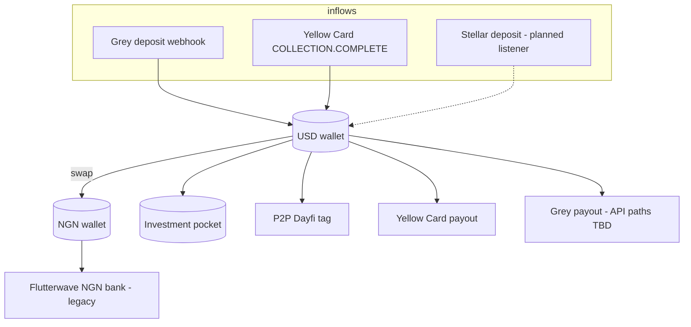

# Payments architecture (production)

**Product:** Dayfi — One Global USD Hub. Borderless Movement. Local Power.

**Primary fiat partner:** [Grey](https://grey.co) (sandbox: [sandbox.grey.co](https://sandbox.grey.co/dashboard))

## Core principle

| Concept | Implementation |
|---------|----------------|
| Single source of truth | `wallets` row with `currency = USD` |
| All inflows → USD | Idempotent `creditUsdInflow()` → `ledger_movements` |
| NGN local spend | Separate `NGN` wallet; fund via `POST /wallets/swap` |
| Investment | `investment_pockets` table |
| Audit trail | `ledger_movements.idempotency_key` UNIQUE |

## Rails

| Rail | Role | Status |
|------|------|--------|
| **Grey** | USD/EUR/GBP accounts, collections, global payouts | Webhook + VA storage live; API base URL from Integrations |
| **Yellow Card** | Africa collections & payouts | Live |
| **Stellar** | USDC/EURC receive | Address provision live; inbound listener planned |
| **Flutterwave** | Nigeria NGN bank out, NGN VA deposits, bills (airtime/data/cable) | Live (`spendCurrency: NGN`; bills debit USD) |

## Key services

| Module | File |
|--------|------|
| Balance / idempotency | `balanceService.ts` |
| Wallet history mirror | `walletActivityService.ts` — `recordWalletActivity`, ledger backfill, P2P/bill repair |
| Bills (Flutterwave) | `billsService.ts` — pay, reverse, labelled wallet rows |
| Inflow FX + credit | `inflowService.ts` / `flutterwaveInflowService.ts` |
| P2P USD transfer | `p2pService.ts` |
| Send quote | `payoutQuoteService.ts` |
| Investment pocket | `investmentService.ts` |
| Notifications (Phase 1) | `notificationService.ts` |
| DayBudget / DayFlow | `dayflow/` — plans, flows, AI chat (per `user_id`) |
| Grey | `greyService.ts` |
| Yellow Card | `yellowCardService.ts` |
| Crypto addresses | `cryptoWalletProvision.ts` |

## Database

- `grey_virtual_accounts` — Grey account metadata per user/currency
- `ledger_movements` — idempotent credits/debits (`source`: `flutterwave`, `bill_pay`, `p2p`, `manual`, …)
- `wallet_transactions` — mobile history mirror (joined to ledger for FX + `ledger_metadata`)
- `user_notifications` — Phase 1 in-app inbox
- `dayflow_plans`, `dayflow_flows`, `dayflow_plan_templates` — DayBudget (per user)
- `p2p_transfers`, `investment_pockets`, `investment_movements`

## Mobile flows

| Journey | Endpoints |
|---------|-----------|
| Receive US Bank | `GET /payments/receive/us-bank`, `GET /payments/grey/accounts` |
| Receive Crypto | `GET /payments/receive/crypto` |
| Send (quote) | `GET /payments/send/quote` → Yellow Card / Grey payout |
| Pay bills | `GET/POST /payments/bills/*` |
| Invest | `POST /payments/investment/*` |
| History | `GET /payments/wallet-transactions` |
| Notifications | `GET /notifications`, unread count, mark read |
| DayBudget | `GET/POST /dayflow/plan`, `/dayflow/chat`, `/dayflow/dashboard` |
| Local NGN | `POST /payments/wallets/swap` |

Full API: [API.md](./API.md) · OpenAPI: [openapi.yaml](./openapi.yaml)

## Grey setup

1. Complete KYB in [Grey sandbox](https://sandbox.grey.co/dashboard/company-settings?tab=business-info) (Dayfi Technologies Limited).
2. **Integrations** → generate API key (`gbsk_…`). Store as `DAYFI_GREY_API_KEY` — never commit real keys.
3. Set `DAYFI_GREY_BASE_URL` to the API host shown in Grey Integrations (sandbox vs production differ).
4. Register webhook: `POST https://your-api/api/v1/payments/grey/webhook`
5. Run `npm run grey:smoke` to verify connectivity.

## Environment

`DAYFI_GREY_API_KEY`, `DAYFI_GREY_BASE_URL`, `DAYFI_GREY_WEBHOOK_SECRET`, `DAYFI_GREY_SANDBOX`
